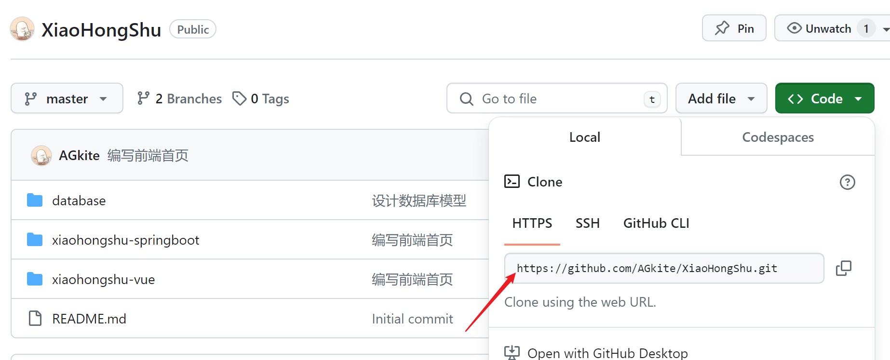
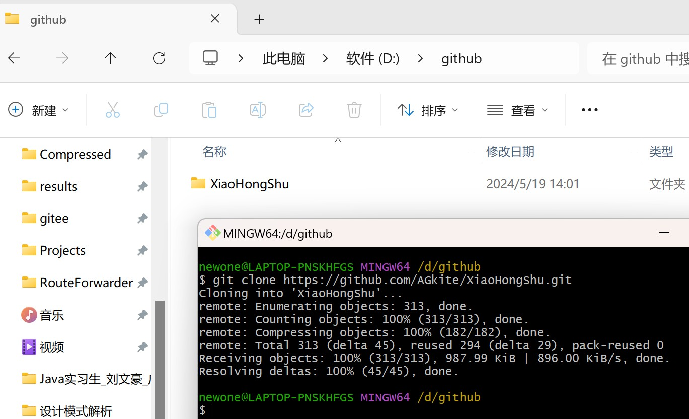
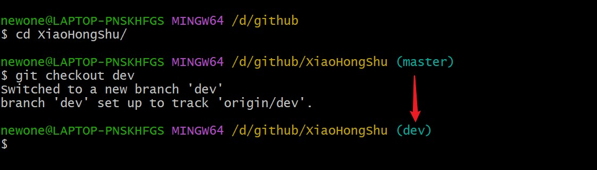
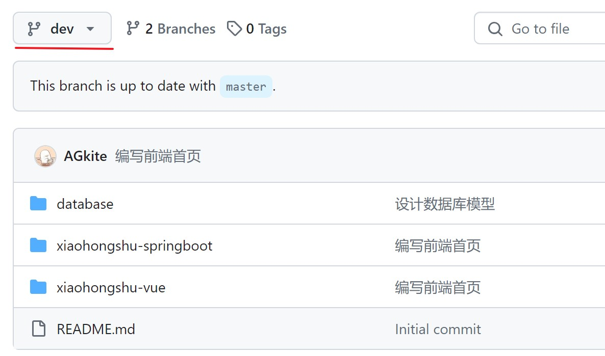
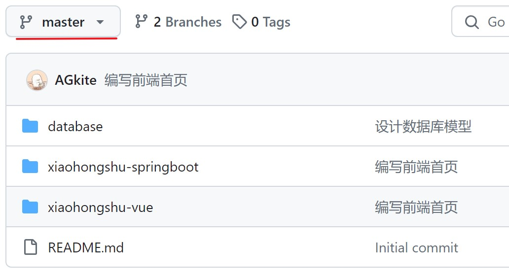
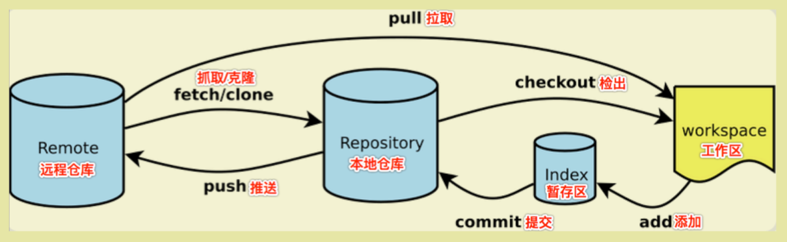
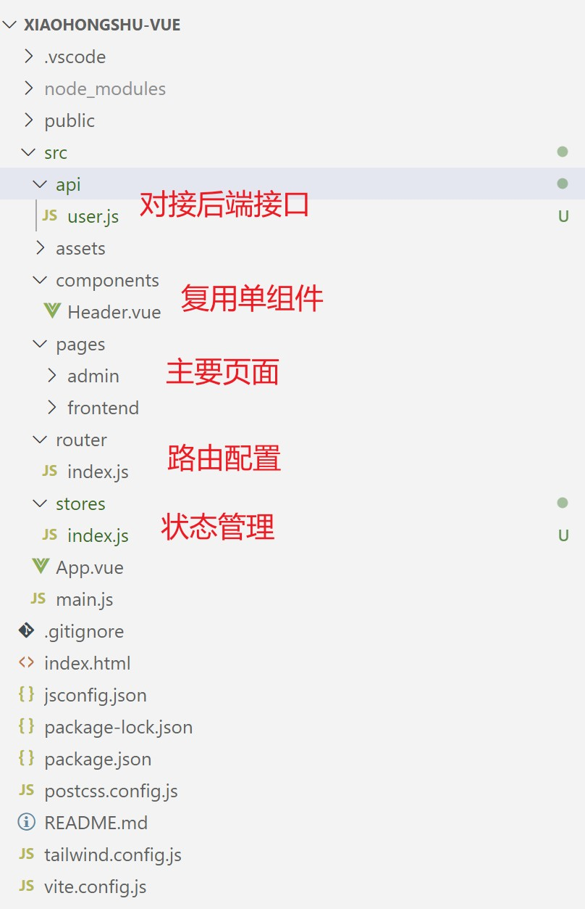
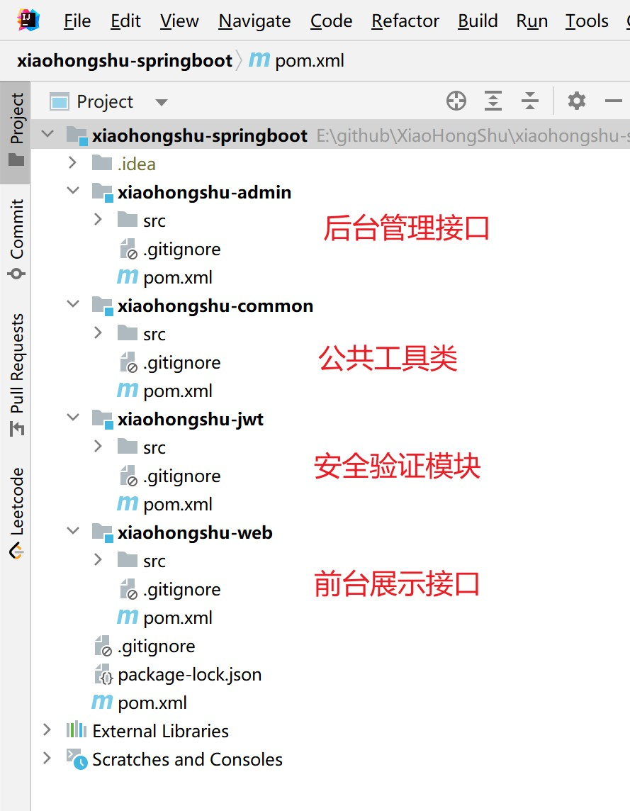
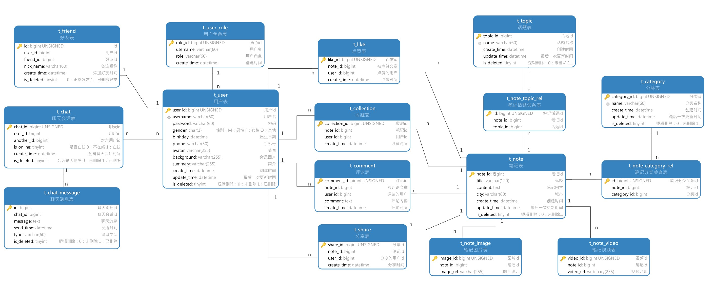

# XiaoHongShu - 仿小红书项目
## 一、加入项目

> 1. 安装git

下载地址：https://git-scm.com/download/win

配置 git, ssh 百度有教程

> 2. 克隆远程仓库到本地

1. 创建`github`文件夹
2. 复制远程仓库地址



3. 右键打开`Git Bash`

4. `git clone`克隆远程仓库

```bash
git clone https://github.com/AGkite/XiaoHongShu.git
```



> 3. 项目开发

**注意：我们设计XiaoHongShu仓库有两个项目分支，分别为：主分支`(master)`和开发分支`(dev)`。提交代码时先提交到`(dev)`分支，由另一个人确认代码没有冲突了再合并到`(master)`分支。防止多人开发时造成混乱。**

1. `cd XiaoHongShu `进入 Dala 仓库

2. `git checkout <分支名称>` 切换到 dev 分支。命令行 `(master)` 变为 `(dev)` 切换成功。



3. 提交时简要写明此次提交增加修改了什么

- `git add .`加入所有修改到暂存区
- `git commit -m "<描述>"`标注提交信息
- `git push origin dev`推送到远程仓库的dev分支



> 4. 检查无误后合并分支 

1. `git checkout master`切换到要合并的分支
2. `git merge dev`合并分支
3. `git push origin master`同步到远程仓库



> 5. Git 学习

学习地址：https://oschina.gitee.io/learn-git-branching/

工作原理：



## 二、Vue 前端

> 1. 前端技术栈

| 技术栈       | 描述                 | 版本    |
| ------------ | -------------------- | ------- |
| Node.js      | JavaScript 运行环境  | 18.18.1 |
| Vue          | 前端框架             | 3.2     |
| TailwindCSS  | CSS样式              | latest  |
| Flowbit      | Tailwind组件框架     | latest  |
| Element Plus | UI 组件库            | latest  |
| Animate.css  | 动态效果             | latest  |
| md-editor-v3 | 在线编辑Markdown文档 | latest  |
| Echarts      | 统计图表             | latest  |
| Pinia        | 状态管理             | latest  |

> 2. 前端项目架构



## 三、SpringBoot 后端

> 1. 后端技术栈

| 技术栈          | 描述                  | 版本   |
| --------------- | --------------------- | ------ |
| Spring Boot     | Spring框架            | 2.6.3  |
| JDK             | Java 开发工具集       | 8      |
| MySQL           | MySQL数据库           | 8.29   |
| Redis           | 内存缓存              | latest |
| MyBatisPlus     | 操作数据库框架        | 3.5.2  |
| Spring Security | Java 应用程序安全框架 | 2.6.3  |
| JWT             | 登录鉴权              | latest |
| Knife4j         | API 文档工具          | 4.3.0  |
| Docker          | 部署容器              | latest |
| MinIO           | 图片资源存储          | latest |
| Lucene          | 全文检索              | latest |
| Nginx           | Web 服务器            | 1.24.0 |

> 2. 项目架构



> 3. 数据库设计

详细见：仓库`/database`目录


